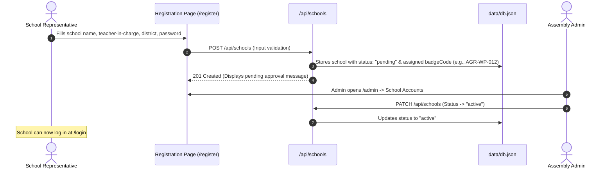
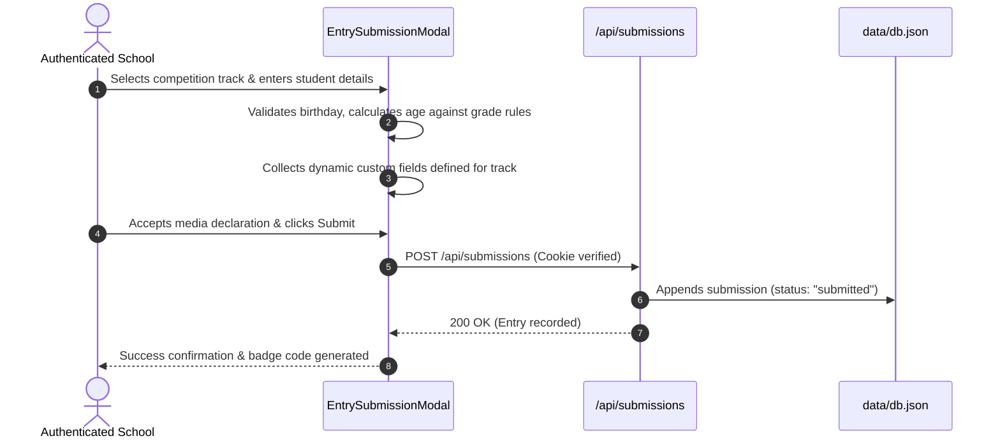

# Agradhi Media Unit Portal — Authentication & Application Architecture Guide

> **Outdated architecture reference:** This document describes the former JSON database and cookie-auth implementation. The active browser application now uses Firebase Authentication and Cloud Firestore. See [Firebase Authentication and Redirects](FIREBASE_AUTH_AND_REDIRECTIONS.md) for the authoritative current flow. The old `/api/*` handlers described below are legacy and are not called by the current UI.

This document provides a comprehensive explanation of how authentication, data storage, user workflows, and Firebase integration work across the **Agradhi Media Unit Portal**.

---

## 1. High-Level Architecture Overview

The application is built on **Next.js 16 (App Router)** with **TypeScript**, **Tailwind CSS**, and a **dual-layer architecture**:

```mermaid
graph TD
    Client[Browser / Client UI] -->|HTTP Requests| NextAPI[Next.js API Routes / Server Actions]
    Client -->|Auth State / Analytics| FirebaseSDK[Firebase Client SDK]
    
    subgraph Server [Server Layer (Node.js)]
        NextAPI -->|HMAC Session Cookie| CookieAuth[Session & Auth Engine (lib/auth.ts)]
        NextAPI -->|Atomic Read/Write & Validation| LocalDB[Atomic JSON Database (lib/db.ts)]
        LocalDB --> DBFile[(data/db.json)]
    end

    subgraph Firebase [Firebase Cloud Services]
        FirebaseSDK --> FBAuth[Firebase Auth]
        FirebaseSDK --> FBDb[Cloud Firestore]
        FirebaseSDK --> FBStorage[Cloud Storage]
        FirebaseSDK --> FBAnalytics[Firebase Analytics]
    end
```

---

## 2. Authentication System

The application uses a **secure, server-verified session cookie architecture** paired with client-side **rate-limiting** and **Firebase Auth** synchronization.

### 2.1 Dual-Role Authentication Model

The portal recognizes three actor states:
1. **Guest (Unauthenticated)**: Can browse the landing page, view open competition tracks, rules, schedule, and public school directory.
2. **School Delegation (`role: 'school'`)**:
   - Represents a participating school delegation.
   - Identified by an assigned unique badge code (e.g., `AGR-COL-001`).
   - Must be in **`active`** status to log in and submit entries (new registrations start as `pending`).
3. **Event Administrator (`role: 'admin'`)**:
   - Has full adjudication privileges.
   - Reviews, scores, and provides feedback on student submissions.
   - Approves/suspends school accounts.
   - Creates, edits, or closes competition categories and custom form fields.

---

### 2.2 Password Security & Hashing (`lib/auth.ts`)

School passwords are never stored in plaintext:
* **Algorithm**: Node.js native `scryptSync` key derivation.
* **Salt**: Cryptographically secure 16-byte random salt generated via `crypto.randomBytes(16)` per user.
* **Format**: Stored as `salt:derivedKeyHex`.
* **Verification**: Uses `crypto.timingSafeEqual` to eliminate timing attacks when verifying passwords.
* **Minimum Complexity**: Minimum 12 characters required for school registrations.

Admin authentication verifies against `ADMIN_EMAIL` and `ADMIN_PASSWORD` defined in `.env.local` using timing-safe string comparison.

---

### 2.3 Session Tokens & Secure Cookies

Session tokens are custom **HMAC-SHA256 signed stateless tokens**:

1. **Payload Structure**:
   ```json
   {
     "role": "school",
     "schoolId": "sch_abc123",
     "expiresAt": 1740000000000
   }
   ```
2. **Signing**:
   * Token format: `<base64url(payload)>.<base64url(hmacSignature)>`
   * Secret: `SESSION_SECRET` from `.env.local` (minimum 32 characters).
3. **Cookie Attributes (`agradhi_session`)**:
   * `httpOnly: true` (inaccessible to client JavaScript; immune to XSS token theft).
   * `secure: true` in production (enforces HTTPS).
   * `sameSite: 'lax'` (protects against CSRF).
   * `maxAge: 28800` (8-hour active session lifetime).

---

### 2.4 Client-Side Auth Context & Rate Limiting (`contexts/AuthContext.tsx`)

The client application wraps all pages in `<AuthProvider>`, providing:
* **Session Hydration**: Queries `/api/auth/session` on initial page load to verify the cookie.
* **In-Memory Rate Limiting Guard**:
  * Tracks failed login attempts within a sliding 5-minute window (`WINDOW_MS = 5 * 60 * 1000`).
  * If **5 consecutive failed attempts** occur, a **2-minute cooldown timer** (`COOLDOWN_SECS = 120`) is triggered.
  * The login form locks automatically, displaying a countdown timer (`mm:ss`) to prevent brute-force attacks.
* **Firebase User State**: Subscribes to Firebase Auth via `onAuthStateChanged(auth, ...)`.

---

## 3. Firebase Integration (`lib/firebase.ts`)

Firebase is integrated into the client application for real-time tracking, cloud file storage, and analytics:

```typescript
// Initialized in lib/firebase.ts
export const app: FirebaseApp = initializeApp(firebaseConfig);
export const auth: Auth = getAuth(app);
export const db: Firestore = getFirestore(app);
export const storage: FirebaseStorage = getStorage(app);
export const getFirebaseAnalytics(): Promise<Analytics | null>;
```

### Services & Roles:
* **Firebase App**: Singleton instance preventing multi-initialization during Next.js Turbopack fast reloads.
* **Firebase Auth (`auth`)**: Handles Firebase-side user identity and token emission.
* **Firestore (`db`)**: Available for real-time live feeds or notifications.
* **Storage (`storage`)**: For student artwork, photography portfolios, and audio files.
* **Analytics (`getFirebaseAnalytics()`)**: Tracks client interactions (e.g. login events with role methods) safely in browser-only environments.

---

## 4. Application Data Flow & Storage

### 4.1 Local Atomic Database (`lib/db.ts`)

The primary data store is located at `data/db.json`:
* **Atomic Writes**: Data is serialized to a temporary PID-specific file (`db.json.<pid>.<random>.tmp`) with `fs.fsyncSync` before being atomically renamed over `data/db.json` using `fs.renameSync`. This guarantees zero file corruption if the server restarts during a write.
* **Strict Validation (`lib/validation.ts`)**: Every read and write validates all collections against schemas before committing changes.
* **Collections**:
  * `schools`: Delegation records (name, badge code, teacher, contact, hashed password, status).
  * `competitions`: Track categories, language medium (`Sinhala`, `English`, `None`), rules, deadlines, and custom questions.
  * `submissions`: Student entries, metadata, URLs/files, custom field responses, scores, and judge feedback.

---

## 5. End-to-End Application Workflows

### 5.1 School Registration & Activation


---

### 5.2 School Submission Workflow


---

### 5.3 Admin Adjudication & Evaluation
1. Admin navigates to `/admin`.
2. Selects **Submission Review**.
3. Filters entries by queue:
   * **Awaiting Review**: Newly submitted entries.
   * **In Progress**: Entries marked for jury discussion or under review.
   * **Decided**: Final decisions (`verified`, `shortlisted`, `rejected`, or `winner`).
4. Updates score (0–100) and writes constructive feedback notes visible to the school on their dashboard.

---

## 6. Directory Structure Reference

```text
├── app/
│   ├── (public)/
│   │   ├── page.tsx               # Assembly Landing Page
│   │   ├── competitions/page.tsx  # Track Directory & Details
│   │   ├── login/page.tsx         # Unified School/Admin Login
│   │   └── register/page.tsx      # School Delegation Registration
│   ├── dashboard/page.tsx         # School Delegation Dashboard
│   ├── admin/page.tsx             # Admin Adjudication Workspace
│   └── api/
│       ├── auth/                  # /session, /logout
│       ├── schools/               # Registration, login, public listings
│       ├── competitions/          # List, create, update tracks
│       └── submissions/           # Submit, filter, score entries
├── components/
│   ├── admin/                     # Adjudication, School & Track Managers
│   ├── dashboard/                 # School Portal Views & Entry Trackers
│   ├── forms/                     # LoginForm, RegisterForm, EntrySubmissionModal
│   ├── landing/                   # Hero, Rules, Schedule, Tracks
│   └── layout/                    # Navbar, Footer, Portals
├── contexts/
│   └── AuthContext.tsx            # Global Session & Firebase Sync Provider
├── lib/
│   ├── auth.ts                    # Crypto, Scrypt, HMAC Tokens, Cookie Config
│   ├── db.ts                      # Atomic JSON Database Controller
│   ├── firebase.ts                # Firebase SDK Services Initialization
│   ├── store.ts                   # Client-side State Manager (useMediaStore)
│   ├── validation.ts              # Zod-like Strict Field Validation & Age Math
│   └── types.ts                   # Shared TypeScript Interfaces
└── data/
    └── db.json                    # Primary Application Data Store
```

---

## 7. Security Best Practices Summary

* **No Plaintext Passwords**: Uses `scryptSync` with cryptographic salts.
* **Timing-Safe Equality**: Password and session signature validations use constant-time checks.
* **XSS Resistant**: Primary session stored in `HttpOnly` cookies.
* **CSRF Mitigation**: Cookies use `SameSite=Lax`.
* **Rate-Limit Throttling**: 5 failed attempts locks logins for 2 minutes to prevent automated password spraying.
* **Input Sanitization**: All API endpoints reject unknown properties and sanitize strings to prevent injection.
